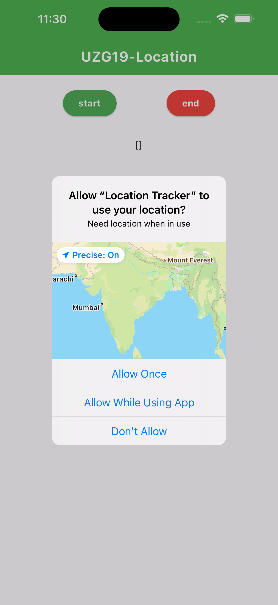
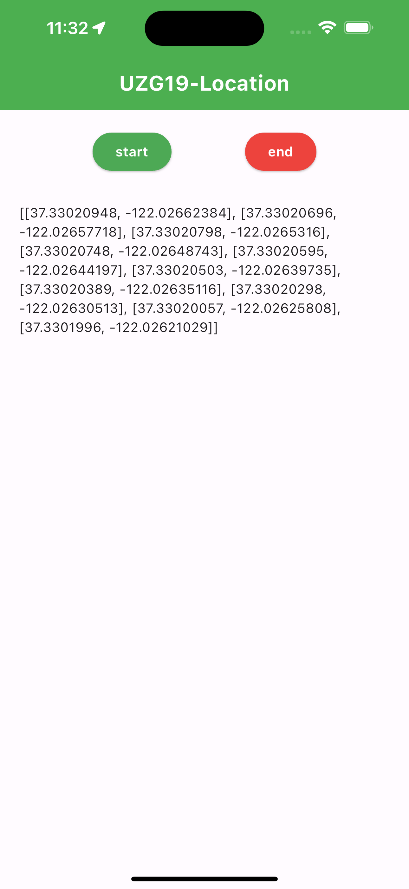
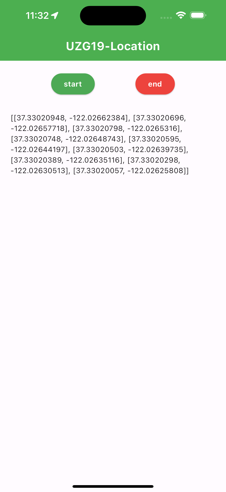

# Track Location in flutter app

A Flutter project that allow you track user location for every second even app is closed.

## [P1] Task

 [task_explain] Track location all the time even in background if possible

## Sub Task
- [01] first permission for location
- [02] get position/latlong
- [03] save data
- [04] show list of data by every second

## Screenshots

  
  
  

<!-- 

 -->

## Dependencies
### [01] : [permission_handler: ^10.4.1]()
### [02] : [geolocator: ^9.0.2]()
### [03] : [shared_preferences: ^2.2.0]()
### [04] : [Flutter Basic]()

## Download APK
-[SDK >= 33](assets/apk)

## About

- [Github Repo]()
- [Jogendra Singh]()